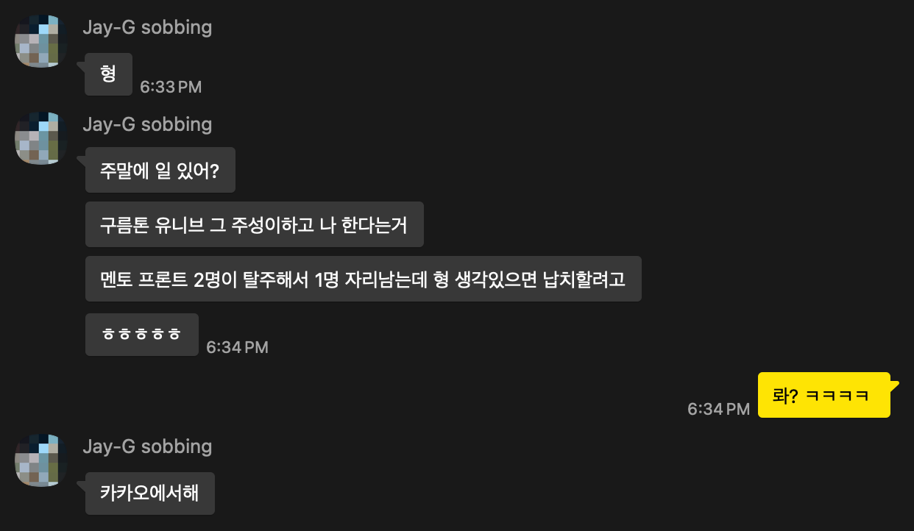
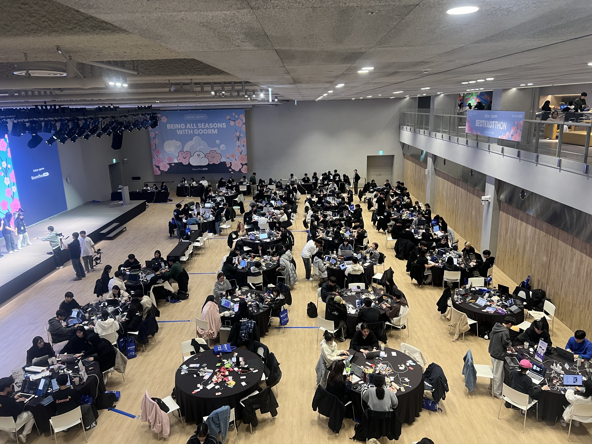
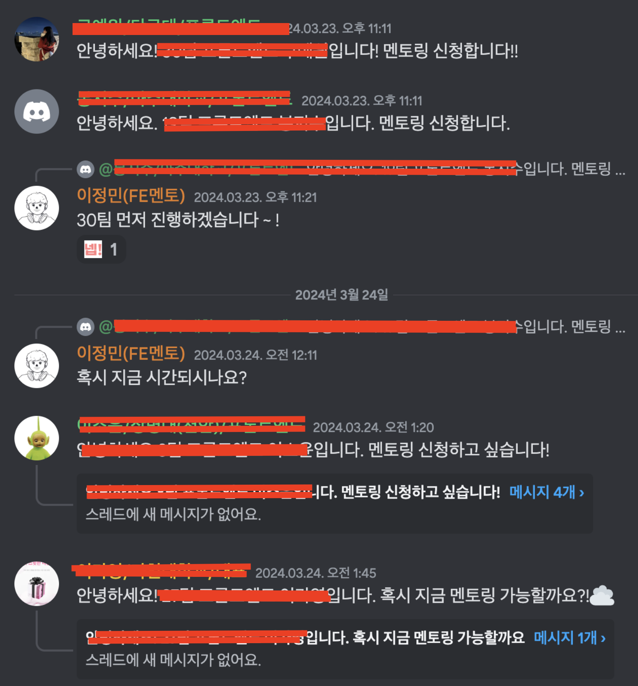
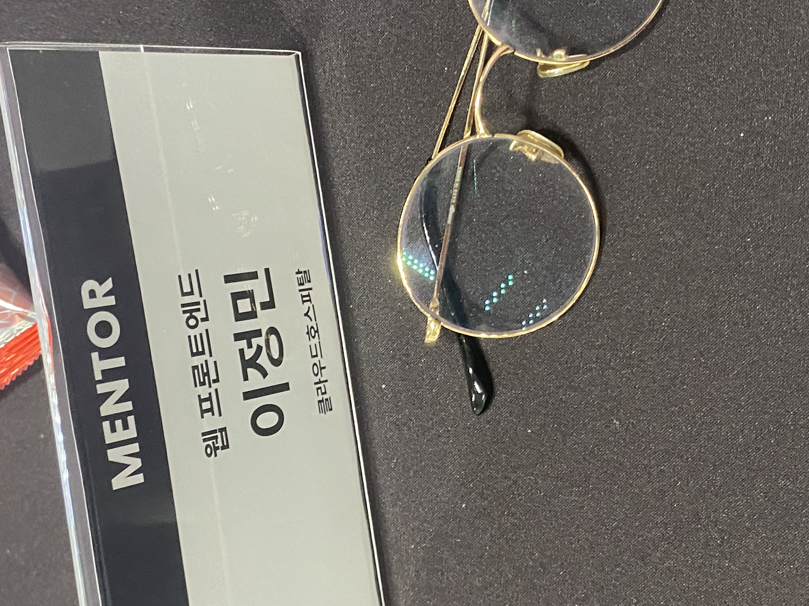

## 계기

구름톤을 다녀오고 나서 얼마 안 된 어느 평일..

구름톤 제주에서 같이 신나게 달렸던 동생이 멘토링을 제안을 해왔다.

그런데 아무리 생각해도 내가 갈 자리가 아닌 것 같았습니다.

`" 나 따위가 멘토를 ...?"`

누군가를 멘토링해줄 위치가 아니였지만 경험자체는 해보고 싶다는 생각이 들었다.

그리고 당시에 마침 구름톤 우승하고난 다음이여서 뽕과 함께 근자감이 있었던 거 같기도 하다.

자리가 사람을 만든다고 했었나... 나도 한번쯤은 멘티가 아닌 멘토로 해커톤에 참여해보면 좋겠다는 생각을 했다.

## 해커톤 동안

그렇다, 도착하고 해커톤 시작할 시간이 다가오자 내 생각보다 상상 이상으로 많은 사람들이 내 앞에 있었다.

모두 36개의 팀이였다. 그래서 이때부터 엄청나게 긴장하기 시작했다.

멘토링 전에도 예상은 했지만 프론트엔드는 보통 후반에 바쁘다.

그래서 나는 시작하고 초반에 꽤 한가했다. 실제 현업에서도 그렇고 해커톤에서도 처음에 여유가 있다가

마지막에 똥줄타는게 `프론트엔드` 아닌가

아니나 다를까 깊은 밤이되니까 슬슬 시작되었었다. 멘티분들마다 질문이 달랐다.

간단한 배포부터 인피니트 스크롤, 그리고 폼 상태관리 등이 있었는데,

다행히도 내가 아는 선에는 다 도움을 줄 수 있었다. 그런데 못 도와준 케이스가 있는데

모바일로 구성된 팀이었다. 안타까웠던점은 모바일쪽은 멘토가 따로 없어서 프론트엔드까지 찾아오게 된 것이었다.

마음이 아팠지만 어떡하겠는가... 나는 모른다 ㅠㅠ

## 끝으로

해커톤이 마무리되고 나서야 비로소 긴장이 풀리기 시작했다. 내가 경험한 모든 것들이 주마등처럼 스쳐 지나갔다.

처음에는 `"과연 내가 멘토 역할을 잘 해낼 수 있을까?"`라는

불안감과 긴장감으로 가득했지만, 멘티분들의 감사 인사를 받고 시간이 지나면서 점차 자신감을 얻을 수 있었다.

다들 내가 과거에 비슷하게 했던 고민 혹은 처음 들어본 고민들을 들어보면서 나도 공부가 되고 복습이 되었다.

또한, 다양한 팀의 프로젝트를 보며 여러 가지 새로운 아이디어와 접근 방식을 접할 수 있었다.

전체적으로 이번 멘토링 경험은 나에게 큰 의미가 있었다. 내가 가지고 있는 지식을 나누는 것뿐만 아니라,

다른 사람들의 열정과 노력을 직접 보면서 동기부여도 다시 한번 받게 되었다.

다음에도 기회가 된다면 꼭 다시 참여하고 싶다.

한 명의 개발자로서 계속해서 성장하고 배우는 것이 나의 목표이기 때문이다.

거기서 만났던 모든 인연들과 관련자분들 행복하고 다같이 더 성장했으면 좋겠다.

