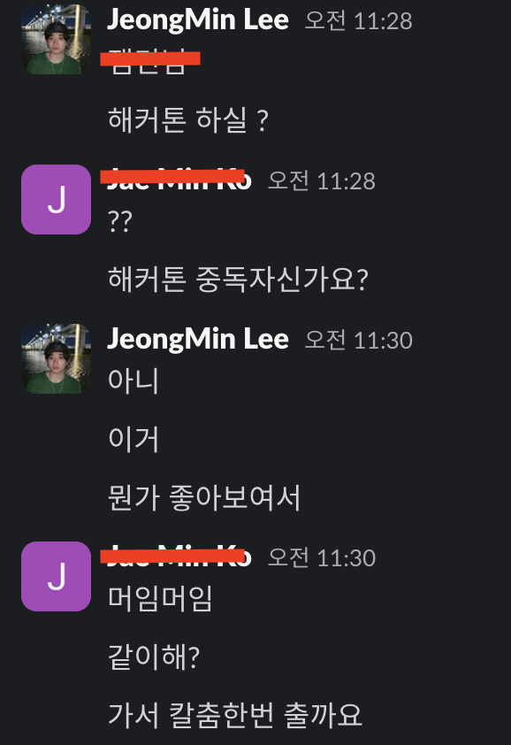
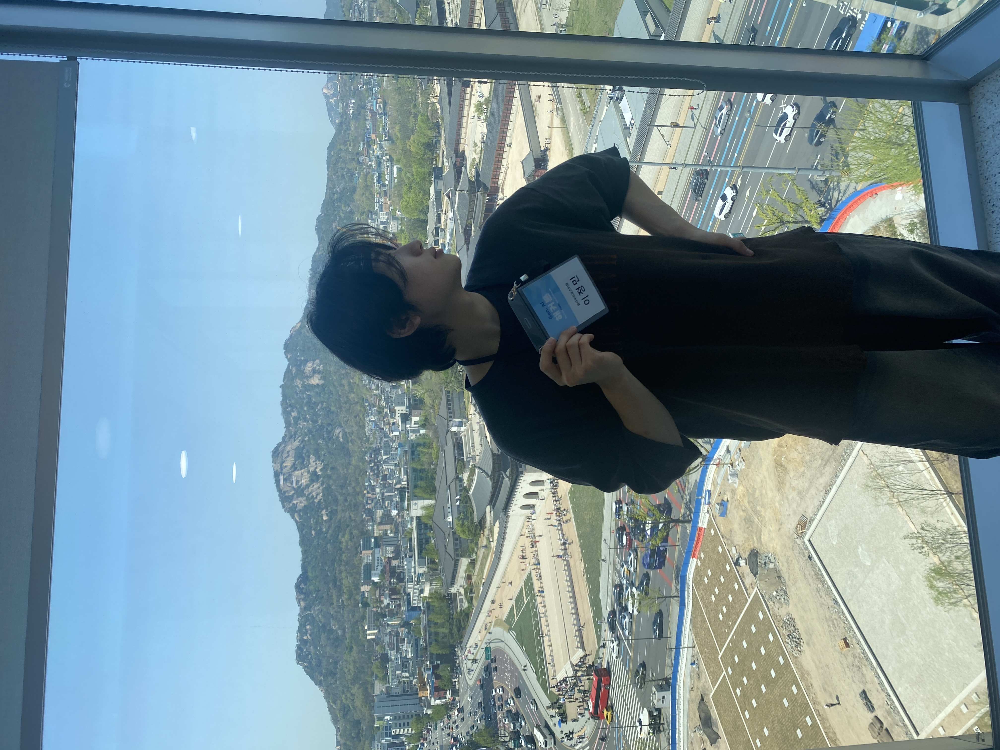
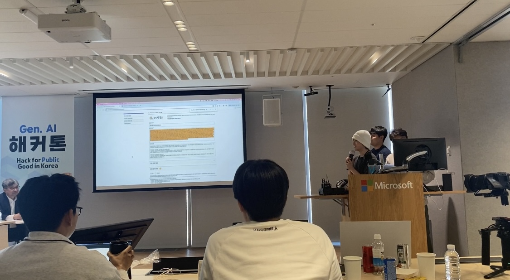
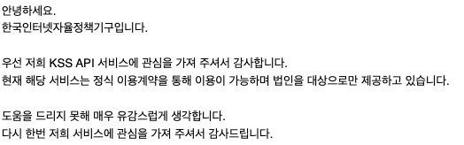
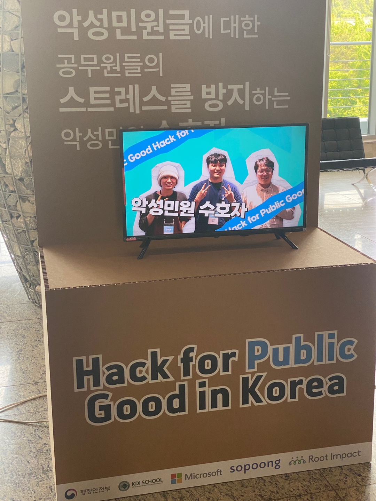
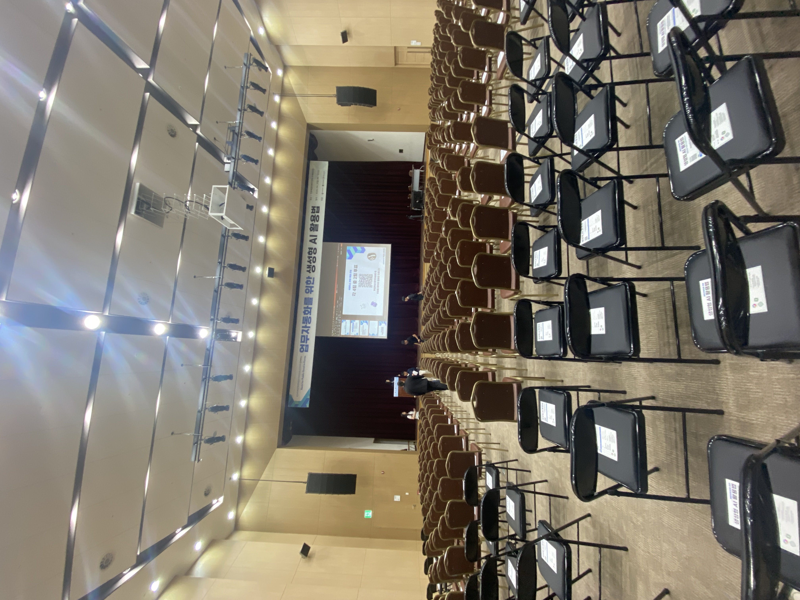
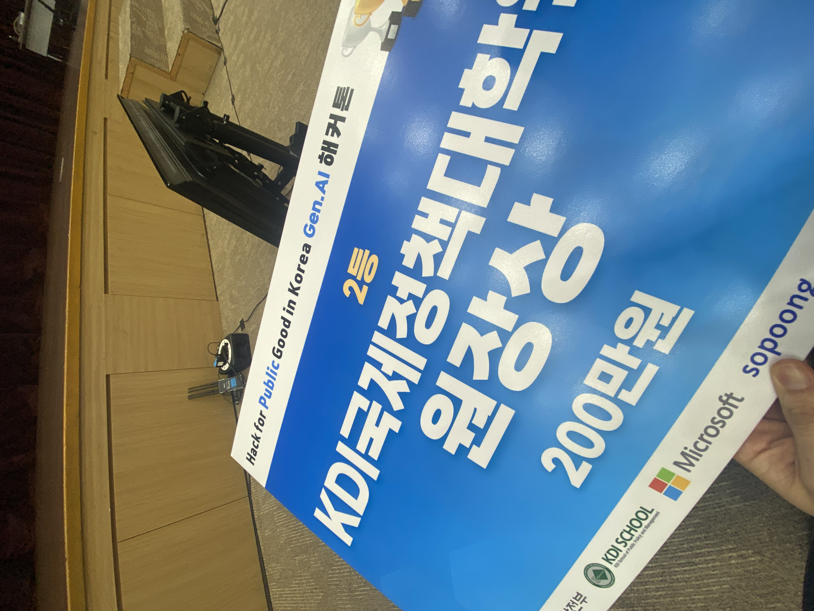

## 계기

해커톤을 잠시 내려놓고 있었던 시기였다.

도파민이 점점 부족해 오는 시기였고 회사 생활은 지루했다.

해커톤을 약간 관심 있게 봐와서 그런가 인스타그램 알고리즘은 세상에 모든 해커톤을 보여주기 시작했다.

무려 `마이크로소프트`가 주관하는 해커톤이였는데 마침 생성형 AI로 하는게 아니던가 !

먼저 구름톤을 다녀올 때, 자기 빼고 갔다고 아쉬워하던 직장 동료에게 바로 플러팅을 했었다

토요일이 바로 해커톤 시작인데 바로 금요일에 신청 하게 되었다.

주제가 `공공부문 혁신`이라는 것이었는데 이때 직장 동료가 기가 막힌 아이디어를 그날 제시를 해주었고

우리는 금요일 새벽까지 구체화를 해가며 해커톤을 준비해 갔다.

## 해커톤 교육

경복궁 옆에 있는 마이크로소프트 본사에 도착 ! 

진짜 일단 뷰가 너무 끝내줬고, 바로 사진을 부탁했었다.

요즘 AI 관련한 해커톤은 항상 먼저 어떻게 사용하는지 간단히 교육해 주고 시작한다.

일단 `마이크로소프트`답게 `azure`에서 OpenAI를 가져와서 사용하는 법을 A-Z까지 알려주셨다.

하지만 뭔가 시총 1위라는 말이 무색하게 토큰에 대한 제한이 너무 많아서 어떤 분은 토큰이 다 떨어져서 교육도 진행 못 하는 상황도 발생했었다.

## 팀빌딩

그렇게 시간은 흘러서 팀빌딩이 시작됬었다. 대부분은 개발자분들이셨지만 전부는 아니었다.

각자 자기소개를 하면서 알게 됐는데 여가부 부장님부터 각종 공공부처의 한자리 하시는 분들도 있었고

본인 업무에서 태스크들을 자동화하고 AI를 배우기 위해서 오신 분들도 더러 계셨다.

하지만 `팀빌딩은 차갑다`. 마이크로소프트 측에서도 생각은 못 하진 않았겠지만

아무래도 개발자들은 개발자를 찾기때문에 비개발자 분들은 아무래도 팀빌딩을 끝까지 못하신 분들도 있었고

뭔가 낙동강 오리알 되는 경우가 있었다. 마음이 아팠지만 어떡하겠는가 우리도 욕심이 있었다.

사실 우리 두명다 `Langchain`을 사용해서 간단한 서비스는 만든 경험이 있었기 때문에 여차하면 그냥 둘이 팀할까 했다.

하지만 아무래도 팀원은 다다익선이 아닌가 싶어서 괜찮아 보이는 싶은 분들에게 먼저 다가가서 팀제안을 했었다.

다행히도 우리 아이디어가 맘에 들었는데 AI를 현업에서 다루고 계시다는 분이 팀으로 합류했었다.

## 해커톤 시작

일단 우리는 무조건 우리 아이디어로 할 생각은 없었지만, 우리가 먼저  온 아이디가 제일 참신하고 좋다고 생각했다.

그렇게 우리는 `악성민원 수호자`라는 팀이름을 정하고 먼저 어떻게 할지 생각하고 작업에 돌입했다.

아이디어는 `민원인이 국민신문고나 각 부처에 민원을 올릴때 악성민원으로 보이면 그걸 필터링 및 순화를 해주는 서비스`라고 간단히 말할 수 있겠다.

사실 이런게 가능한 이유는 모델 자체적으로도 인지능력이 상당히 높아졌기 때문이라고 말 할 수 있겠다.

사실 1차적인 목표인 `Langchain.js`로 내가 직접 로직을 짜서 프로젝트를 하고 싶었지만 AI 개발자분이 Python으로 다 처리할 수 있으니까 프론트쪽에 힘을 주게 되었다.

나머지는 AI 개발자분의 로직을 같이 검토하는 방향으로 진행했었다. 그런데 AI 개발자분은 웹개발쪽 경험은 전무하셔서 API 서비쪽도 `FAST API`도 급하게 올렸었다.

다행히도 배포는 필수상황이 아니여서 다행인 것 같았다.

아무래도 한국어 특화된 모델을 찾을 수가 없었고, 사람이 듣고 기분 나빠할 만한 비속어에 대한 데이터셋은 터무니 없이 부족하긴했다.

그래서 AI 개발자분은 생각해 내신 게 [`Jail Breaking`](https://learnprompting.org/docs/prompt_hacking/jailbreaking)이라는 기법인데 GPT-3.5 모델은 해당 기법을 통해 프롬프팅으로 OPENAI 측에서 걸어놓은 제한 범주를 벗어나

비속어를 사용하여 우리가 원하는 상황에 맞는 더미데이터를 잔뜩 만들 수 있었고 이를 토대로 더 상위 모델은 GPT-4.0으로 돌려서 데이터 셋을 만들고

다시 우리 GPT-3.5에 파인튜닝을 해서 성능을 올리려고 노력했다. 그리고 마지막에는 우리 회사 동료의 수파베이스 슈퍼캐리로 임시로 DB 간단하게 만들어서 

우리가 생각하던 MVP를 만들 수 있었다.

## 데모

발표가 거의 11시쯤이었던 같은데 정말 버티기 힘들어서 다른 분들 발표하는데 집중 못 하고 결국엔 잠들었었다. 

결국엔 우리 차례가 왔었고 발표를 나눠서 발표를 했습니다. 

다른 잘하신 분들도 많아서 긴장했는데 생각보다 심사위원분들 반응도 좋았어서 내심 기대를 했던 것 같네요. 

운이 좋게 본선에서 올라가는 4팀에 들어가게 되었습니다. 

말은 해커톤이였지만 하루밤에  안끝나고 1주 뒤에 있는 본선에 가서 공무원 관계자  명 발표하는 게 진짜 마무리였습니다. 하ㅏㅎㅎ..

1주일동안 저희가 하룻밤에 만든 이 MVP를 더 디벨롭을 할까 말까 하다가 결국엔 안 했었습니다. 

한가지 시도는 해봤는데 KISO에서 제공 해주는 [비속어 데이터셋](https://www.safekiso.com/)을 통해서 학습을 시켜서 비약적인 모델 학습을 해볼까 했었습니다.

하지만...

그런 이유로 우리는 발표와 스토리텔링에 더 힘을 주어서 발표 준비를 엄청 열심히 했답니다.

## 본선 및 후기

본선은 `정부세종컨벤션센터`에서 진행을 했는데 회사 연차내고 갔다.

가자마자 우리를 기다리는 건 뜬금없는 우리 사진... ㅋㅋㅋ

그리고 우리가 하룻밤만에 만든 MVP를 `공무원 400여명` 앞에서 발표하고 투표를 받는 식으로 진행이 되었는데

스케일에 압도가 먼저 되었다... ㅋㅋ ;

다른 3팀의 발표를 보면서 아찔했다.

다들 하나같이 본인들의 MVP를 진짜 엄청나게 발전시켜 가져왔다.

`멀티모달`부터... 어떤 한팀은 무슨 `커스텀 ChatGPT`를 만들어와 버렸는데 아찔했다.

하지만 우리의 발표는 공무원들의 감성을 자극했는지 다행이도 2등을 했답니다.

수상한 것도 너무 좋았지만 다른 해커톤과 다르게 심사의원분들이 모든 것을 정하지 않고, 
실제 잠재 사용자 ( 약 400명 )에게 현장에서 투표를 받고 진행되어 공공부문에 실제로 
도움이 될 것 같다는 것을 인정받으니까 가슴이 뜨거워지는 경험...을 했습니다. 

악성민원때문에 속앓이 많으실 공무원분들 꼭 저희 서비스가 아니더라도.. 
어떤식으로든 개선되어서 속앓이 안하시는 그런 환경속에서 근무하셨으면 좋겠습니다 - !

<iframe
  width="560"
  height="315"
  src="https://www.youtube.com/embed/jPIXoZWOmVo"
  title="YouTube video player"
  frameborder="0"
  allow="accelerometer; autoplay; clipboard-write; encrypted-media; gyroscope; picture-in-picture"
  allowfullscreen
></iframe>

