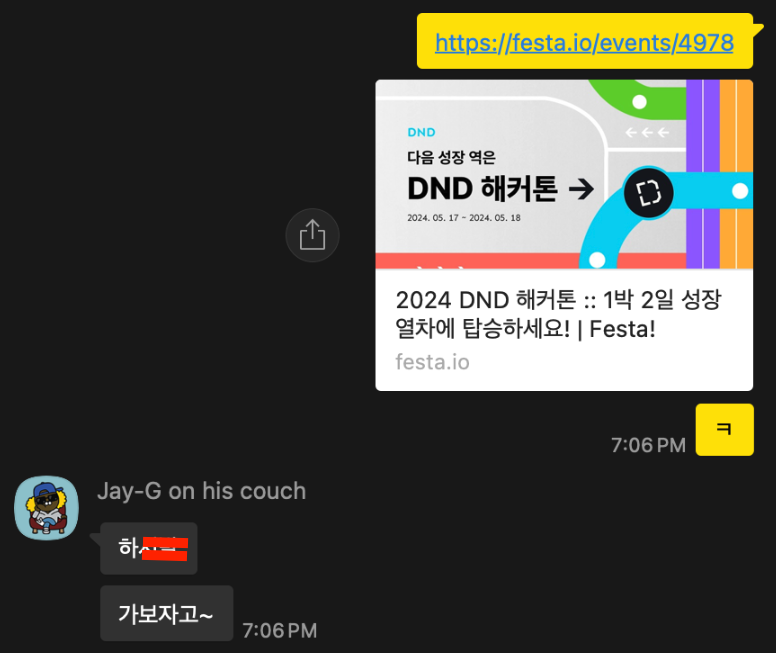
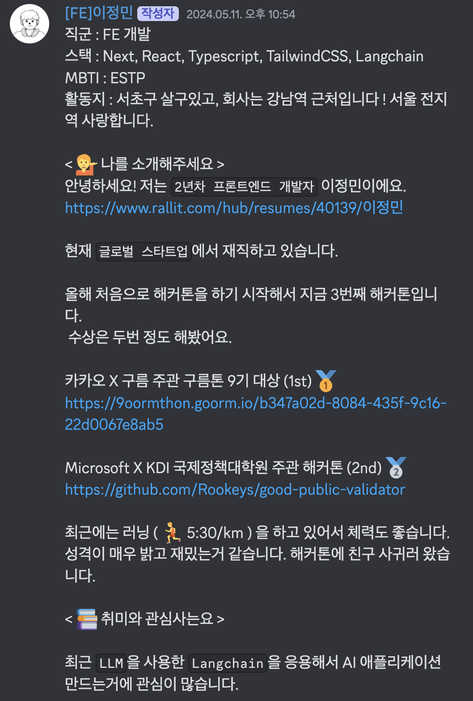
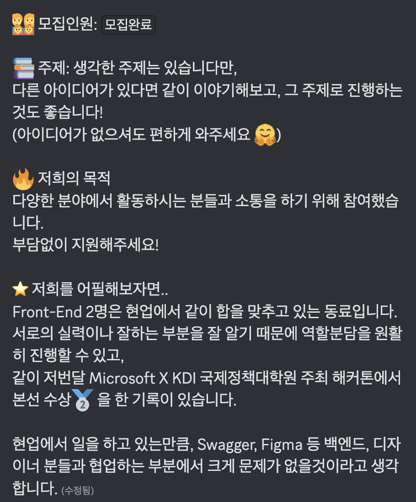
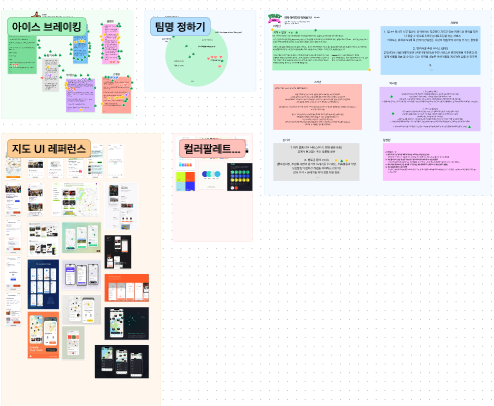
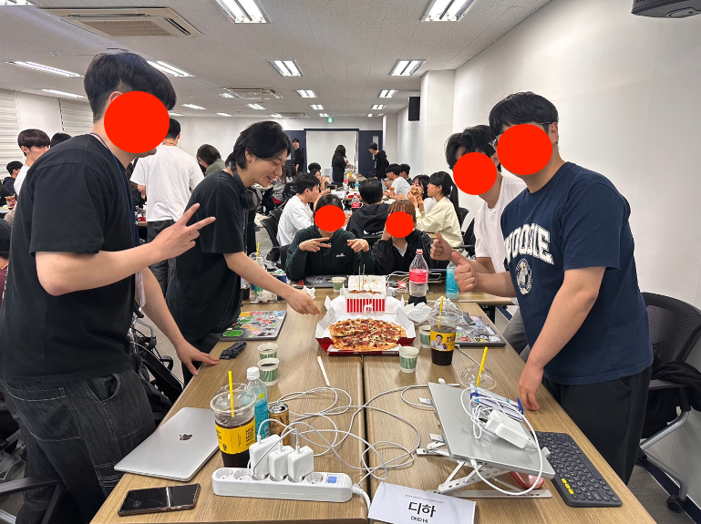
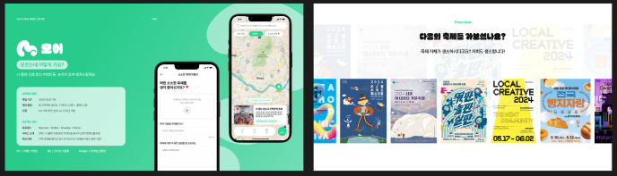
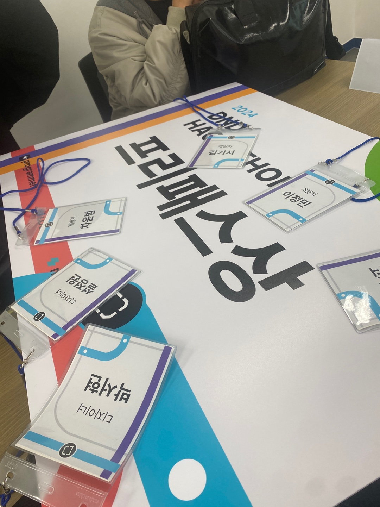
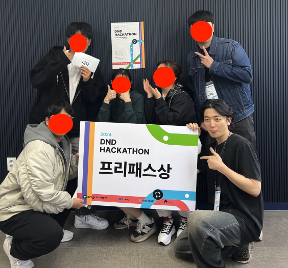
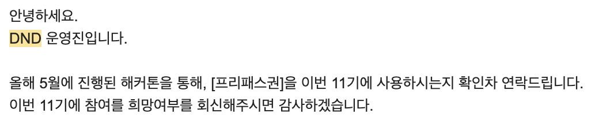

## 계기

해커톤 몇번 해보니까 해커톤 공고가 알고리즘에 자꾸 나오게 되었습니다.

저번 해커톤에서 합이 잘 맞았던 동료에게 다시한번 추파를 던져 보았습니다.

아니다 다를까 바로 덥석 물어버리는 그...

그렇게 우리는 신청하고 운이 좋게 둘다 합격되어서 참여하게 되었습니다.

## 팀빌딩

팀으로 지원한 사람들과 개인으로 지원하신 사람들이 각각 있었습니다.

디스코드에 초대가 되서 각자 자기소개 채널에서 본인 PR을 올리는게 1단계였구요.

모집글에서 팀원을 구하는 팀에 들어가거나, 본인이 팀원들을 구하는 글을 작성하였습니다.

일단 저와 동료는 팀원 모집글을 작성하였습니다.

운좋게 실력있는 디자이너분들과 백엔드분들이 합류해주셨습니다 - !

그리고 바로 시간을 잡아서 팀명과 아이디에이션을 진행하였습니다.

대신 해커톤의 주제 3가지 중 두가지가 `일상`, `지역` 이였는데요. 나머지 한가지 키워드가 뭔지 몰라서

제 아이디어는

두가지 키워드를 중심으로 `지역마다 축제부터 시작해서 본인 강아지 생일같이 사소한 이벤트`까지 보여줄 수 있는 서비스였습니다.

다른 팀원들도 좋은 아이디어를 제안했지만 민주적으로 투표해서 `제 아이디어가 채택`되었습니다. 😉

그렇게 정하고 나서 사실 더 자세하게 구체화는 하지 않았습니다.

## 해커톤

남서울 터미널 옆에 있는 프로그래머스 교육장에서 해커톤이 진행되었습니다.

처음엔 다들 초면이라서 어색어색했지만 금방 풀어나갔습니다.

밝혀진 마지막 키워드는 바로 `불편함`이였습니다. 제가 냈던 아이디어가 내포되어 있다해도 무방한 키워드라서 변경없이 그대로 갔어요 !

디자이너분들은 이미 해커톤 오기전부터 레퍼런스를 좀 조사해놓으셔서 진짜 UI 찍어내시는게 정말 빨랐습니다.

저는 어떤 맵을 쓸까하다가, 제일 익숙한 카카오 맵을 쓰기로 했습니다.

빠르게 갖다쓸 SDK가 있을까 하다가 찾은게 이 [패키지](https://github.com/JaeSeoKim/react-kakao-maps-sdk)였는데요.

공식 패키지는 아니였는데 굉장히 추상화가 잘되어있어서 진짜 해커톤 내내 잘 사용한거 같습니다.

`해커톤의 꽃` 야식을 먹고 힘을 내고나서, 진행하는데 문제가 있었습니다.

저희는 가고싶은 이벤트는 계정에 저장을 하고 관리해야하는데, 물론 이를 간단하게 아아디 패스워드로 구현할 수 있었지만

저희는 어째서인지 Oauth로 풀고싶다는 결론이 났었습니다. 그리고 그렇게 몇시간을 끙끙대서 하느라고 다들 죽을 맛이였죠 ㅋㅋㅋ ..

새벽이라 그런가 쉽게 될 것 같은데도 잘 안되더군요. 멋지게 `next-auth`로 캐리해준 제 동료에게.. 리스펙을 보냅니다.

항상 해커톤은 프론트엔드가 마지막에 똥줄을 타는 것 같습니다. 그렇게 발표까지 계속 달렸어요 하핳..

## 발표 및 데모

일단 팀장으로써 발표를 맡게 되었습니다. 그런데 마지막까지 프론트쪽 코드짜느라고 디자이너분이 기가막히게 만들어주신

발표자료를 자세히 못봐서 개요와 설명은 디자이너 분에게 발표를 맡기고 데모 및 시연은 제가 맡아서 했습니다.

<iframe
  width="560"
  height="315"
  src="https://www.youtube.com/embed/R-oSUp2eXLY?si=IMn_kZqAgmrnFpjT"
  title="YouTube video player"
  frameBorder="0"
  allow="accelerometer; autoplay; clipboard-write; encrypted-media; gyroscope; picture-in-picture; web-share"
  referrerPolicy="strict-origin-when-cross-origin"
  allowFullScreen
></iframe>

진짜 운명같이 발표 순서도 마지막이였고 개인적으로 많은 팀들이 해커톤에서 제시한 키워드에 충족하는(?) 서비스를 만들지 않으신거 같았습니다.

그점이 좀 아쉬웠던 것 같아요 ! 그렇게 저희는 `프리패스 상`을 받게 되었습니다.

이제 해커톤은 좀 쉬고..... 프로젝트를 해보려구요.. 하하

