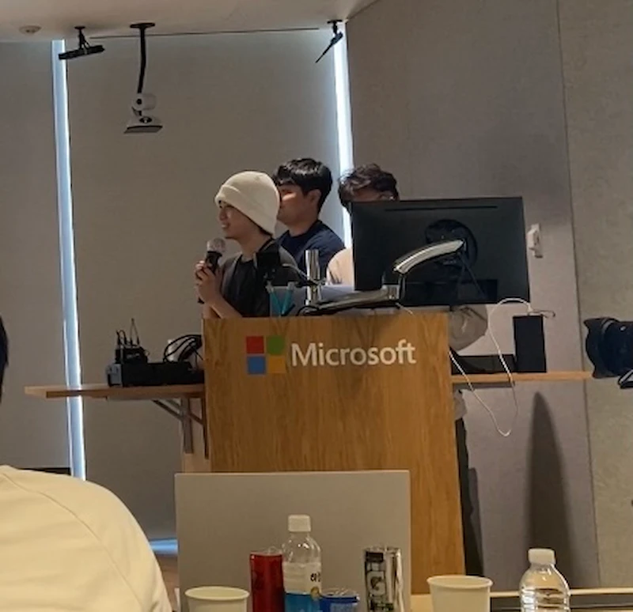

 

> [1년 회고](https://froggy1014.github.io/blog/2024/02/06/front-end-one-year)를 쓴게 엊그제 같은데 벌써 2년을 꽉 채워버렸다.. 그간 뭐했는지 적어보고 다음을 이야기 해보려고 합니다 ~

## 지난 일년간 어땠었나 ?

작년 회고를 썼었던 당시와처음 입사하고나서 1년때와 그 다음 1년부터는 사뭇 다른 경험을 많이 했었다. 당시 회고를 읽어봤는데 당시는 특별히 외부활동이나 스터디를 활발히 하지 않고 회사에 적응하기 위해 업무에 집중한 것을 확인할 수 있다.
올 한 해동안 어땟는지 하나씩 써보려고 한다.

### | 해커톤

갓 1년이 지나고 1인분을 할 수 있겠지라는 마음을 가지고 가볍게 신청한 해커톤을 시작으로 자신감이 생겨 여기저기 지원했었다. 그렇게 작년 구름톤을 시작으로 4개의 해커톤을 참여해 총 3개의 해커톤에서 🏆을 받았었다.
올해 트렌드도 그렀지만 작년에도 AI가 뜨거운 감자였는데 활용하면서 재미를 봤었는데 재밌었다. 그리고 그안에서 좋은 인연들도 만나고, 회사동료랑도 참여하면서 더 끈끈해 진거 같다.

자세한 후기는 아래 링크에서 확인할 수 있다.

- [구름톤 후기](https://froggy1014.github.io/blog/2024/03/01/goormthon)
- [마이크로소프트 해커톤 후기](https://froggy1014.github.io/blog/2024/04/23/microsoft-hackerthon)
- [DND 해커톤 후기](https://froggy1014.github.io/blog/2024/05/18/dnd-hackerthon)
- [Seoul Tech Impact 해커톤](https://devpost.com/software/mayo-my-art-your-object)

<table>
  <tr>
    <td className="text-center"></td>
    <td className="text-center"></td>
  </tr>
  <tr>
    <td className="text-center"></td>
    <td className="text-center"></td>
  </tr>
</table>

### | 멘토링

해커톤 같이 팀을 하고 알게된 동생이 해커톤의 `멘토`을 권유했었다. 해커톤을 몇개 해봤다고 멘토로 나가도 되나 싶었지만 언제 이런거 해보나 싶어서 덥석 수락했었다.
내 걱정과는 다르게 다행히 내가 도와줄 수 있는게 많았었고, 감사 메일도 받아보고 고민도 들어보고 해커톤에서 일어날 수 있는 자잘한 이슈들을 같이 보면서 재미있고 보람차게 했었다.

평소에 느껴본적없는(?) 그런 보람과 감사인사를 받고 하다보니.. 더 열심히해서 해커톤뿐만 아니라 더 심층적으로 멘토링을 해줄 수 있는 그런 개발자가 되고 싶었다.

- [벚꽃톤 후기](https://froggy1014.github.io/blog/2024/03/24/goormthon-univ)
- [단풍톤 후기](https://froggy1014.github.io/blog/2024/11/24/goormthon-univ-2)

<table>
  <tr>
    <td className="text-center"></td>
    <td className="text-center"></td>
  </tr>
</table>

### | 대외활동

퇴근을 하고 크고작은 `컨퍼런스`를 가기도하고, `스터디`에 참여도 하면서 연차도 몇번 사용했던 것 같다. 해커톤과 스터디에만 6개정도의 연차를 사용하지 않았나 싶다.
그리고 체계가 잡혀있는 사이드 프로젝트를 하기위해 `DND`라는 동아리에도 들어가보고, 많은 개발자분들과 인사이트 공유하고 스터디를 하기위해서 `사이프`라는 동아리에 들어가서
활동해보면서 정말 내가 얼마나 작고 부족한지 많이 알게되었고 그렇게 많이 배워가면서 조금이나마 회사에서 채워지지 않는 것을 채우려고 발악을 했었던 것 같습니다.

- [당근테크밋업](https://froggy1014.github.io/blog/2024/10/7/daggn-meet-up)
- [데보션 프론트엔드 최적화 스터디](https://froggy1014.github.io/docs/reading/2024-11-03-front-optimize-performance)
- [DND 10기 동아리](https://dnd.ac/projects/79)
- [사이프 3기](https://froggy1014.github.io/blog/2025/01/31/sipe)

<table>
  <tr>
    <td className="text-center"></td>
    <td className="text-center"></td>
  </tr>
</table>

### | 회사내에서의 입지

어느 시점부터 내가 주도적으로 진행하는 프로젝트를 맡게되었다. 아무래도 스타트업이다보니까 분업하기가 쉽지않고 빠르게 피쳐들이 요구되고 만들어져야하다보니 그것에 맞게 움직여야했다.
나름 빠릿빠릿하게 처리하고, `done is better than perfect`가 목표인 나에게는 나름 잘 맞았던 것 같았다. 그렇게 회사분들에게 신임도 더 받게된 것 같고, 요즘은 일하면서 불편하거나 수동적인 작업을 개선해나가고, 오래된 레거시에서 벗어나
완전히 새롭게 `모노레포`로 만드는 작업을 하고 있다.

- `디자인시스템 구축`
- `모노레포 구축`
- `Domain 관리 자동화`
- 사내 환경변수 관리 `사내 CLI 개발`
- `OpenAPI`를 통한 API와 프론트엔드 간의 CI 구축

등과 같은 작업을 하고 있다. 아직 배울게 많이 있고 고치고 싶은게 많은 것 같다. 

## 작년의 목표는 이뤘을까 ? 

반은 아니고 반은 맞는 것 같다.`CS 공부`와 `플러터`는 못이루었던거 같다. 하지만 `사이드 프로젝트`와 `개발 관련 도서`는 적잖게 읽은 것 같다. 블로그에 정리를 안해서 문제지만...

## 2025년에 무엇을 해볼까 ? 

당장 생각나는 건 `이직`이다. 말처럼 쉬운것도 아니고, 나는 아직 현 회사에서 할 수 있는게 많다고 생각되지만 항상 마음에 품는 것 같다.
물론 그 외에도 하고 싶은건 정말 많다. 개발 서적과 CS 공부도 놓치않고 싶고, 항상 목표하는 해외 취업을 위해서라면 `leetcode`도 시작해야할 것 같다.

그리고 꾸준히 러닝도하고 마라톤도 나가서 더 정신적으로나 육체적으로나 건강한 나를 가꾸고 싶다. 올해도 작년처럼 바쁘고 많은 경험을 해보면 좋겠다.

