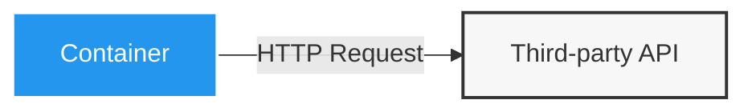
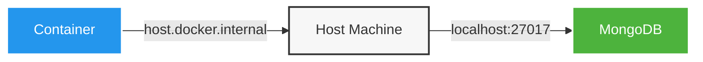
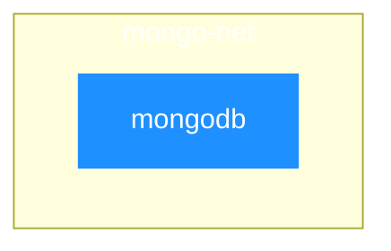
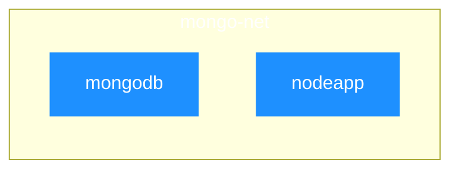

## 컨테이너에서 외부 API 연결하기

컨테이너에서 외부 API로 요청은 문제없이 가능합니다.

```js
app.get("/movies", async (req, res) => {
  try {
    const response = await axios.get("https://swapi.dev/api/films");
    res.status(200).json({ movies: response.data });
  } catch (error) {
    res.status(500).json({ message: "Something went wrong." });
  }
});
```



## 컨테이너에서 로컬호스트 접근하기

컨테이너안에 있는 애플리케이션이 내부 로컬 호스트 머신과 통신하려면, 주소에 `host.docker.internal` 을 연결해줍니다.
이를 도커가 로컬 호스트 머신의 IP 주소로 내부적으로 치환을 해주게 됩니다.

```js
mongoose.connect(
  "mongodb://host.docker.internal:27017/swfavorites",
  { useNewUrlParser: true },
  (err) => {
    if (err) {
      console.log(err);
    } else {
      app.listen(3000);
    }
  },
);
```



## 컨테이너간 통신

컨테이너간 통신은 주소에 통신하고자하는 컨테이너의 IP 주소 혹은 network를 구축하여 컨테이너 이름을 넣어야합니다.

### 1. IP 주소 삽입

이는 컨테이너를 실행시킨 다음에, `inspect`를 통해서 주소를 알아봐야합니다.

```bash
docker run -d --name mongodb mongo
docker container inspect mongodb
```

```json
"NetworkSettings": {
    // ...netowrk info
    "Networks": {
        "bridge": {
            // ...bridge info
            "IPAddress": "172.17.0.2", <--
        }
    }
}
```

데이터베이스 연결

```js
mongoose.connect(
  "mongodb://172.17.0.2:27017/swfavorites",
  { useNewUrlParser: true },
  (err) => {
    if (err) {
      console.log(err);
    } else {
      app.listen(3000);
    }
  },
);
```

하지만 한계점으로는 IP 주소는 변경이 될 수가 있습니다. 그 때문에 도커 네트워크를 활용하게 됩니다.

### 2. 컨테이너 이름 삽입

컨테이너 이름을 삽입하여, 통신을 하게끔 만들기 위해서는 일단 도커에서 `Network`를 만들어야합니다.

```bash
# Network 생성
docker network create mongo-net
# Network 그룹안에 mongoDB 컨테이너 실행
docker run -d --name mongodb --network mongo-net mongo
```



그리고 MongoDB와 연결할 컨테이너에서 MongoDB 통신 주소를 컨테이너 이름을 붙여서 아래와 같이 변경합니다.

```js
mongoose.connect(
  "mongodb://mongodb:27017/swfavorites",
  { useNewUrlParser: true },
  (err) => {
    if (err) {
      console.log(err);
    } else {
      app.listen(3000);
    }
  },
);
```

```bash
docker run -d --name nodeapp --network mongo-net --rm nodeapp
```



## 도커 네트워크 IP 해석 이해하기

도커가 그러면 이러한 네트워크들을 이용해서 컨테이너의 IP 주소를 어떻게 알아낼까요?

도커는 내장된 DNS 서버를 통해 컨테이너 이름을 IP 주소로 자동 변환해줍니다. 컨테이너에서 `host.docker.internal` 혹은 `container name`을 사용하면, 도커의 DNS 서버가 이를 인식하고 해당하는 IP 주소로 변환합니다.

이러한 DNS 해석 덕분에 개발자는 실제 IP 주소를 알 필요 없이 컨테이너 이름만으로 통신이 가능합니다.

## 도커 드라이버란 ?

도커 네트워크 드라이버는 **컨테이너 간의 통신을 관리하는 핵심 구성 요소**입니다. 도커는 기본적으로 다음과 같은 네트워크 드라이버를 제공합니다:

- **bridge**: 기본 네트워크 드라이버로, 동일한 Docker 호스트 내의 컨테이너 간 통신을 가능하게 합니다.
- **host**: 컨테이너와 Docker 호스트 간의 네트워크 격리를 제거합니다.
- **none**: 모든 네트워킹을 비활성화하여 컨테이너를 완전히 격리시킵니다.
- **overlay**: 여러 Docker 데몬을 함께 연결하여 Swarm 서비스가 서로 통신할 수 있게 합니다.

:::info
**Docker Swarm이란?**

Docker Swarm은 여러 Docker 호스트를 클러스터로 묶어 관리할 수 있게 해주는 도커의 네이티브 컨테이너 오케스트레이션 도구입니다. 
:::

- **ipvlan**: IPv4와 IPv6 주소 지정에 대한 완벽한 제어를 제공합니다.
- **macvlan**: 컨테이너에 MAC 주소를 할당하여 물리적 네트워크에서 직접 통신할 수 있게 합니다.


## Reference

- [Docker drivers](https://docs.docker.com/engine/network/#drivers)
